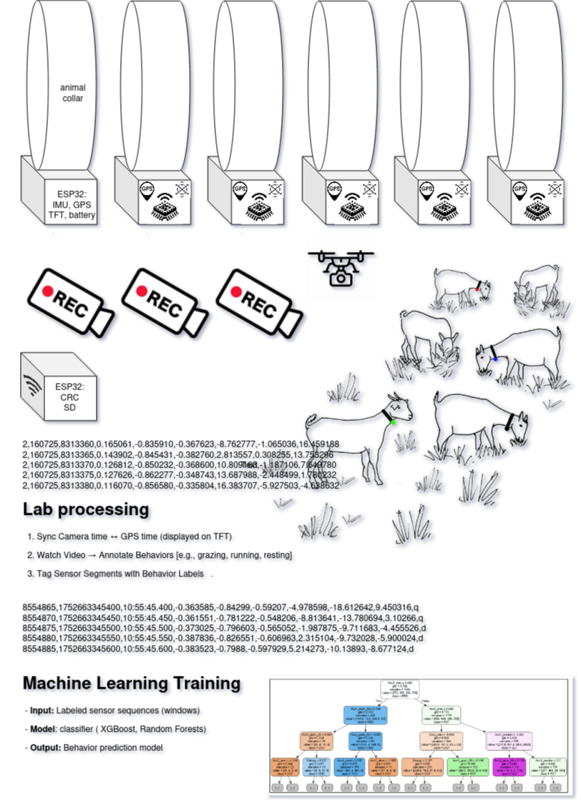

> ⚠️ **Work in Progress** — The documentation and firmware are being finalized. This version is incomplete and may change before publication.
# IMUcabra
Lightweight IMU collar for goat behavior monitoring using ESP32 and ESP-NOW
# Lightweight IMU-Based Collar for Goat Behavior Monitoring

  
*Figure: Overview of the collar system and data flow.*

This repository contains the full design, firmware, and documentation for a **low-power, lightweight wearable sensor system** used to monitor goat behavior in semi-extensive farming systems. The device uses a **6-axis IMU (BMI-160)** and **ESP32 microcontroller**, transmitting data via **ESP-NOW** to a nearby base station (e.g., laptop or Raspberry Pi).

This system was developed for research on **fine-grained ingestive behavior** and **pasture quality assessment**, and is designed for **minimal animal impact**, **long battery life**, and **field robustness**.

See [TODO.md](TODO.md) for current development status.

🔧 **Key Features**:
- 65 g total weight
- 4 Hz sampling (configurable)
- ESP-NOW wireless (no LoRa gateway needed)
- Solar charging support
- Open-source firmware and 3D-printable housing
- Synchronization with video via GPS timestamps

📦**Applications**:
- Grazing, browsing, and rumination detection
- Tasting vs. eating classification
- Precision livestock farming (PLF)
- Pasture evaluation using animal behavior

📄**Published in**:  
[](https://doi.org/10.5281/zenodo.1234567)
[aceptation pending]  DOI: [10.1016/j.compag.2024.XX.XXX]

## 📂 Directory Structure
IMUcabra/
│
├── firmware/               # ESP32 Arduino code
├── hardware/               # Schematics, PCB, BOM
├── 3d-print/               # STL files for enclosure
├── software/               # Data logging scripts (Python)
├── figures/                # Diagrams, photos
├── documentation/          # User guide, calibration notes
└── README.md

## 🛠️ How to Build the Device

### 1. Components (Bill of Materials - BOM)

| Part | Value | Source |
|------|------|--------|
| ESP32 LilyGo T-Display | ~€5 | AliExpress |
| BMI-160 | ~€2 | Same |
| GPS neo 6m | ~€5 | Same |
| LiPo Battery 103450 2500 mAh | ~2.5€ | AliExpress |
| JST PH 2.0 | For charging | Optional |
| 3D-Printed Case | ABS or PLA | See `3d-print/` |
| Nylon Collar | Standard farm ID collar | Local supplier |

### 2. Assembly
1. Solder components to a custom PCB or perfboard (see `hardware/schematic.pdf`).
2. Flash the firmware (see `firmware/`).
3. Insert into 3D-printed case and attach to goat’s collar.

## 📡 Data Transmission

Uses **ESP-NOW** for peer-to-peer communication. No Wi-Fi network or internet required.

- Base station (laptop/RPi) runs a simple Python listener.
- Data packets include: timestamp, ax, ay, az, gx, gy, gz.
- Synchronized with video using GPS timestamps.

## 📚 Citation

If you use this system in your research, please cite:

```bibtex
@article{Baro2024IMUcabra,
  title={A lightweight, low-cost, open-source IMU-Based Collar System for Real-time Behavior Monitoring in Semi-Extensive Goat Farming},
  author={Jesus A. Baro, Jose A. Bodero},
  journal={Computers and Electronics in Agriculture},
  year={2024},
  volume={XX},
  pages={XXX--XXX},
  doi={10.XXXX/XXXXXX}
}

 
 
📎 License 

MIT License – see LICENSE file. Free to use, modify, and distribute with attribution. 
